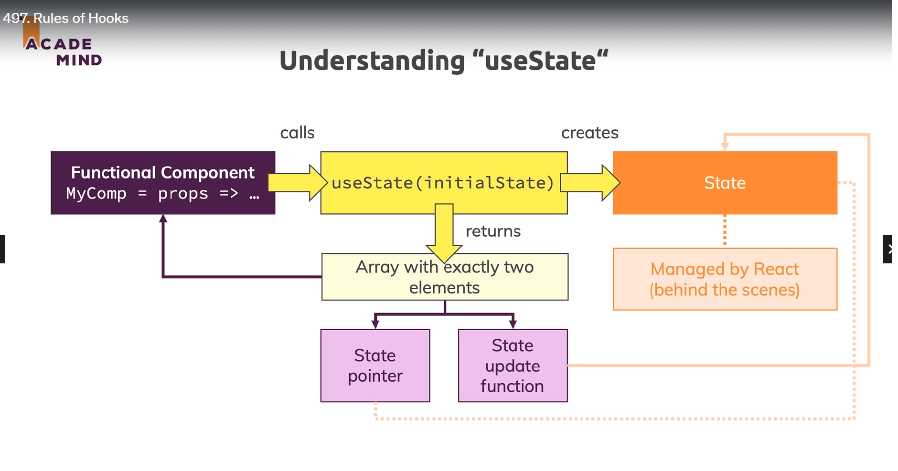

# Understanding UseState

- UseState is initialized in functional components at root level .
- It creates a state in and it is managed by react ay backend
- It outputs an array as an argument whose first value is theState pointer which gives updated state 
  and second one is the state update function which can be used to update the state.

# Guidlines to use hooks(General) 
- Cannot use hooks inside for loop, if statememt, Always use them at root level.
- Always use hooks inside functional components.
- Cannot use hooks inside nested functions.

